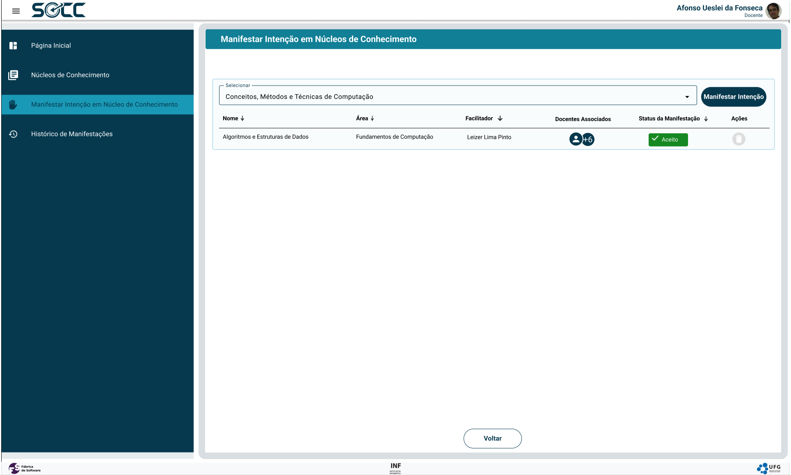

# SOCC
Desenvolvimento Full Stack - UFG

# Caso de Uso: Manifestar intenção participar de núcleo de conhecimento

### Tela 2 - Manifestar Intenção em Núcleo de Conhecimento 

| Campo Selecionar |  | Não | Dropdown | | O campo funciona para digitação alfanumérica mas no fim selecionando uma opção | [RI03x](#RI) |
| Nome |  | Sim | Alfanumérico | | | [RI04x](#RI) |
| Área |  | Sim | Alfanumérico | | | [RI04x](#RI) |
| Facilitador |  | Sim | Alfanumérico | | Facilitador do Núcleo de Conhecimento | [RI04x](#RI) |
| Docentes Associados |  | Sim | Seleção múltipla  | |  | |
| Status da Manifestação |  | Sim | Rótulo de status | | Valores: Aceito, Aberto ou Rejeitado | |
| Manifestar Intenção |  | Não | Botão | | Botão habilitado somente após seleção de um núcleo no "Campo Selecionar" e se o docente ainda não tiver o número máximo de núcleos permitido com status "Aceito". | [RI01x](#RI) |
| Exluir Manifestação |  |  | Botão | | Ativo somente em manifestações com status "Aberto". | [RI02x](#RI) |
| Voltar |  |  | Botão | | |  |
